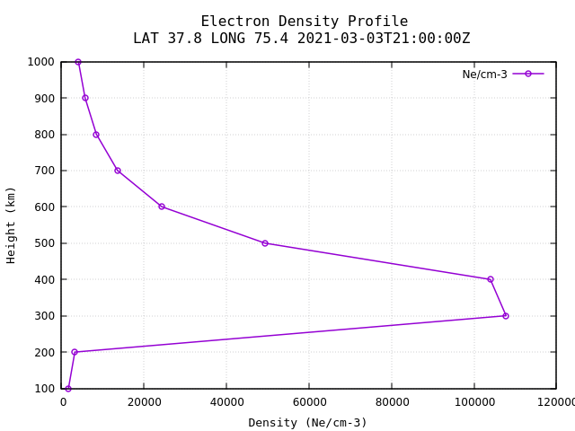

## C-based IRI Driver

This repo contains a simple C-program acting as a driver for the [International Reference Ionosphere (IRI)](https://irimodel.org/), version 2016. IRI is written in FORTRAN-77 and is freely available.

This is an exercise in mixed-language computing on Linux operating systems. Some of the findings
may be machine-specific.



### System Description

- Platform: NVIDIA Jetson Nano
- Kernel version, architecture, and OS: `4.9.201-tegra aarch64 GNU/Linux`

### Compilers

- GCC: `gcc-8 (Ubuntu/Linaro 8.4.0-1ubuntu1~18.04) 8.4.0`
- GFORTRAN: `GNU Fortran (Ubuntu/Linaro 8.4.0-1ubuntu1~18.04) 8.4.0`

### Other Dependencies

- `make`: `GNU Make 4.1`
- `gnuplot`

### Build Process

The C and FORTRAN source code are found in `./src/c/` and `./src/fort/`, respectively.
The FORTRAN source code is made freely available to the public at [this source]
The `Makefile` in this top-level directory instructs GFORTRAN how to compile the source
files and object files.

The `Makefile` contains an option at the top, `FORTOPTS`; it is currently set to
`-g` to include debug symbol output. This makes the binaries larger, but doesn't
seem to affect execution time (though it has not been benchmarked).

#### `iri-exe`

By invoking

```
$ make iri-exe
```

`gfortran` will compile and link all of the FORTRAN-77 IRI source files into an executable,
`iri-exe`. This is the conventional mode of building and running the model, and comes from
the `00readme.txt` file in the IRI-2016 source code repository.

#### `libiri.so`

One can create a shared object of the IRI subroutines and functions by invoking

```
$ make libiri.so
```

This shared object must be dynamically linked with any programs seeking to use the
available subroutines and functions.

#### `c-iri`

The `c-iri` executable is the final executable, created from the `main.c` program
and linked to the `libiri.so`.

```
$ make c-iri
```

### Running

The model can be run as convention as `./iri-exe`. Ensure the data files (`*.dat` and `*.asc`)
are present in the current working directory; the `iri_sub` subroutine requires this.

To run the C-driver, invoke

```
$ LD_LIBRARY_PATH=<path-to-libiri.so> ./c-iri
```

An output file will be generated in the current working directory called `outf_data.txt`;
it contains rows and columns of the data found in the output array, `OUTF`.

### Notes and Processes

#### Shared object file `libiri.so` with position-independent code

When attempting to link the shared objects into a shared object library,
`ld` gives us lots of errors about sybmols "which may bind externally".
Compiler-suggested solution is to recompile modules with `-fPIC`. Position-independent
code, or PIC, is code that is executable from any location within an object file.

```
...
/usr/bin/ld: irifun.o: relocation R_AARCH64_ADR_PREL_PG_HI21 against symbol `atb1_' which may bind externally can not be used when making a shared object; recompile with -fPIC
irifun.o: In function `schnevpdb1_':
irifun.for:(.text+0x3c7c): dangerous relocation: unsupported relocation
/usr/bin/ld: irifun.o: relocation R_AARCH64_ADR_PREL_PG_HI21 against symbol `atb1_' which may bind externally can not be used when making a shared object; recompile with -fPIC
irifun.for:(.text+0x3c9c): dangerous relocation: unsupported relocation
/usr/bin/ld: irifun.o: relocation R_AARCH64_ADR_PREL_PG_HI21 against symbol `atb1_' which may bind externally can not be used when making a shared object; recompile with -fPIC
...
```

This may arise due to how the newer compiler (`gfortran-8`) handles relocating, though I am unsure.

#### `ISO_C_BINDING` for FORTRAN and C interoperability

Through looking at the `readelf` output and confirming with other sources (see bottom for references),
I noticed the FORTRAN functions and subroutines are compiled with an `_` after the name.

```
...
    94: 0000000000045a8c   700 FUNC    GLOBAL DEFAULT   11 intershc_
    95: 000000000000d9a0 46996 FUNC    GLOBAL DEFAULT   11 iri_sub_
...
```

Seeing this, my first attempt was to have the C program call the subroutine "straight",
that is, without explicitly using the `ISO_C_BINDING`. This ended in a fair share of
`SIGSEGV` segmentation faults. Undeterred, a few visits to Stackoverflow and the `gfortran`
manual indicated that a) the modern approach was to use the `ISO_C_BINDING` and b) which
C types corresponded to FORTRAN types, which FORTRAN passes by reference.

The C binding that resulted can be found in `./src/fort/run_iri.f08`. This is a simple
subroutine which takes in C arguments, passes them directly to the `iri_sub` subroutine
found in `./src/fort/irisub.for`, and returns.

Note how the C-bound subroutine does *not* contain a trailing underscore:

```
    93: 00000000000064ec   136 FUNC    GLOBAL DEFAULT   11 do_run_iri
```

#### `main.c` C program

While I endeavored to make a C program that runs the IRI model with flexible inputs for
date, time, and location, I opted to keep some hardcoded values. As discussed below,
the `c-iri` results are not correct, and thus it would have been time wasted to add
calls to `getc` and `putc` for input flexibility. Instead, the `main.c` program showcases
my current knowledge of mixed C-FORTRAN programming and the extent to which I understand
some fairly esoteric and arcane ionosphere model code.

### Results

The C driver runs successfully, without any segmentation faults or runtime warnings. However,
the results written to `outf_data.txt` are incorrect. I suspect this is due to a model configuration
error I have missed in the C program; the types correspond correctly, and I do not believe this
is a byte alignment issue as both programs are compiled on the same machine. I'm still curious,
and would love to see if anyone else who has endeavored to do this encountered similar problems.

I know it's passing arguments correctly for two reasons:

  1. Using `gdb` to examine the running code, I can look at the input variables and
     arrays within the FORTRAN routine and see their values
  2. The output array has lots of `-1.0` values; in the FORTRAN routine, it initializes
     the output array `OUTF` as all `-1.0`.

The plot you see is made using the data output file from running the model conventionally. The 
data output file is `fort.7`, and the cleaned data file (with `#` comments) is `fort.7.cleaned.txt`;
both are included in this repository. The `gnuplot` program is used to create the plot with the
following commands:

```
gnuplot> plot "fort.7.cleaned.txt" using 2:1 title "Ne/cm-3" with linespoints lw 1.5 pt 6
gnuplot> set title "Electron Density Profile\nLAT 37.8 LONG 75.4 2021-03-03T11:00:00Z"
gnuplot> set ylabel "Height (km)" font 'mono,10'
gnuplot> set xlabel "Density (Ne/cm-3)" font 'mono,10'
```
